# books_I_recommend

# 2004 - The Data Warehouse ETL Toolkit (Ralph Kimball)

I am a data engineer, I had the opportunity of taking data from transactional databases to data lakes and from there to datamarts with star schemas with fact tables and dim table. That is really formulatic but some best practices does not hurt you. This book is a great explanation of why we agreggate data the way we do it.

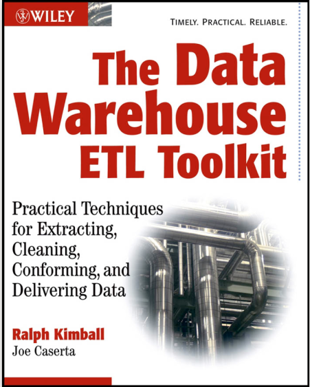

# Algorithhms 4th Edition by Robert Sedgewick, Kevin Wayne

A lot of technical interviewers ask data structures and algorithms questions. This book and a lot of leetcode exercises will prepare you for that.

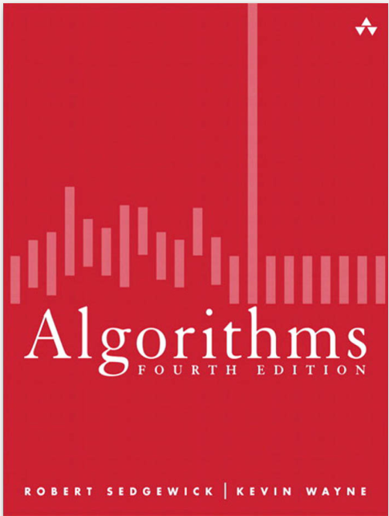

# confluent-kafka-definitive-guide-complete

Go from zero to hero with just one book (plus actually using the tool) 

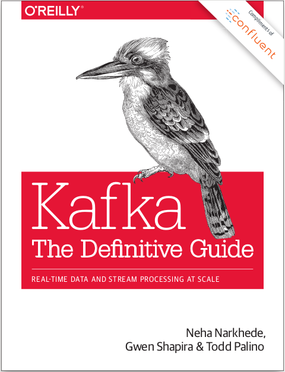

# Designing Data Intensive Applications

This is the bible of system design. This book explain in a really simple way topis like  when should we use SQL or NoSQL databases, why horizontal scaling performs better than vertical scaling and many others.

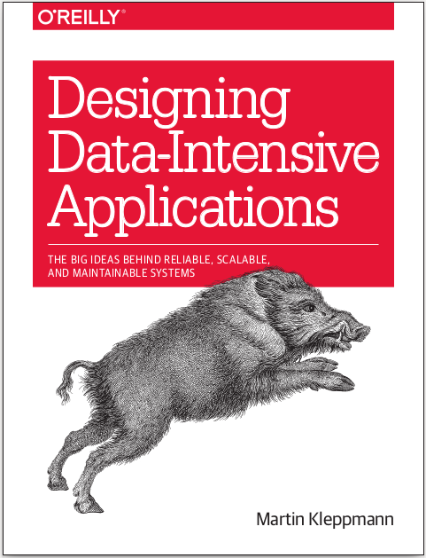

# Fluent python

This book along with the next one (Learning python by Mark Lutz) and the book about design patterns is everything you need to know about python.

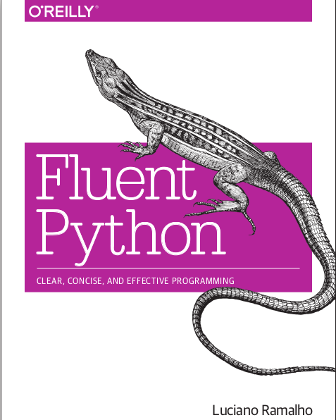

# Learning python by Mark Lutz

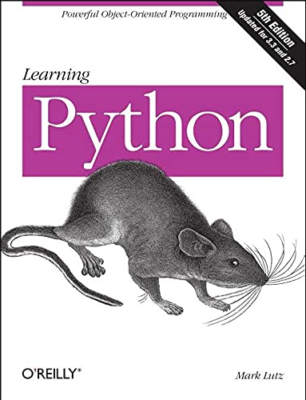

# Erich Gamma, Richard Helm, Ralph Johnson, John M. Vlissides-Design Patterns_ Elements of Reusable Object-Oriented Software  -Addison-Wesley Professional (1994)

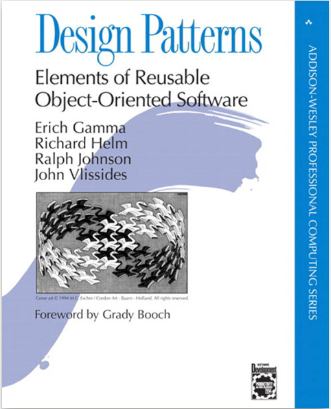

# Hadoop The Definitive Guide, 4th Edition

Great book understaing important concepts like data replication, block size and bottlenecks with storing in a single disk.

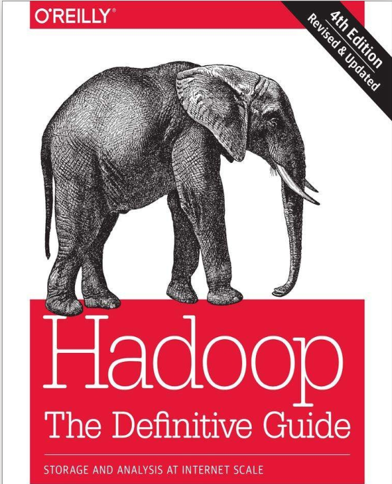

# Head_First_Java_Second_Edition

I am data engineer and most the things I do are python related stuff, but I also like to use open source tools, some of the them are pieces of code written in java.

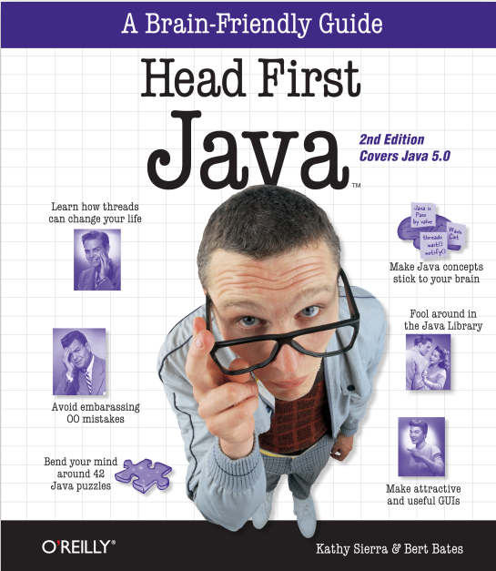

# LearningSpark2.0

Great book to get up and running pretty fast

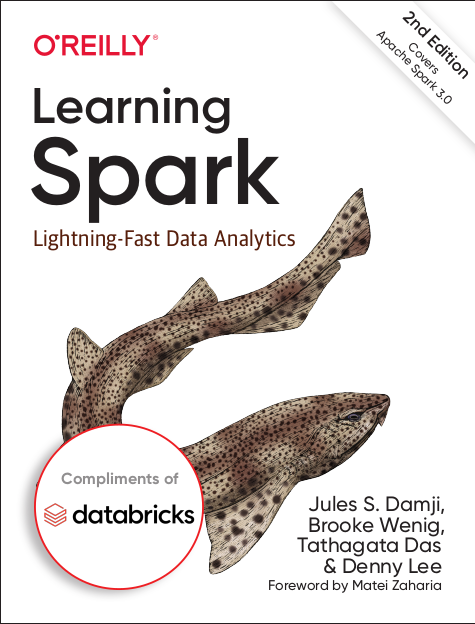

# Programming hive

In customized Google Cloud servers, AWS EMR or on-premise servers is highly likely that you'll need hive for creating tables and managing partitions

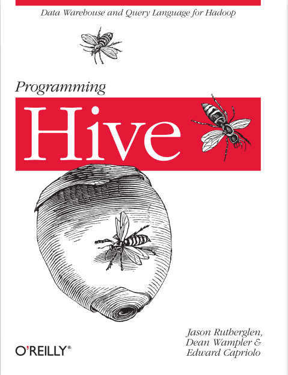